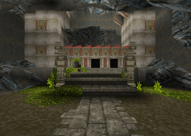
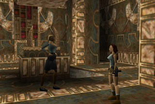
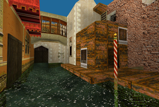
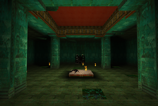
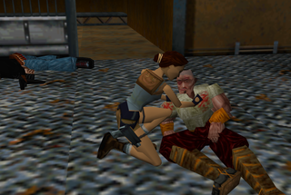
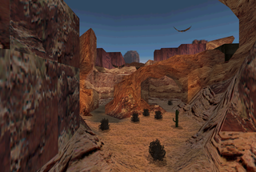
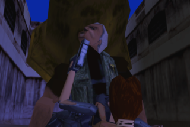

TRN
===

Tomb Raider Nostalgia - View levels and play cut scenes for old Tomb Raider games 1/2/3 (maybe 4 one day).

[Browse and view TR1/2/3 levels](http://www.evpopov.com)

Main keys are:
  * **Z/Q/S/D** to move into the level (**A/W/S/D** in QWERTY mode)
  * **SPACE** / **X** to go UP/DOWN
  * **Right mouse button** to take control of (and release) the rotation of the camera with the mouse
  * **ENTER** to show/hide the informational panels

Hit the **H** key to display an help panel that lists all the keys you can use.

Cutscenes are the levels with a  icon after the level name.

You can browse local levels on your hard drive by browsing the **TRN.html** page.

Levels used in the web site linked above have been converted to a JSON format (used by threeJS) thanks to the **TRN.html** page (set the *makeJSON* variable to *true* in this page and browse it if you want to convert some TR levels to JSON format for your own use).

## Roadmap
- not too much, maybe TR4 support...

## Screenshots

